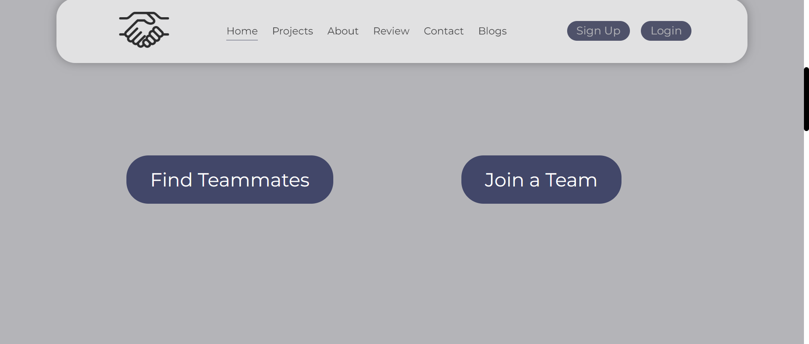
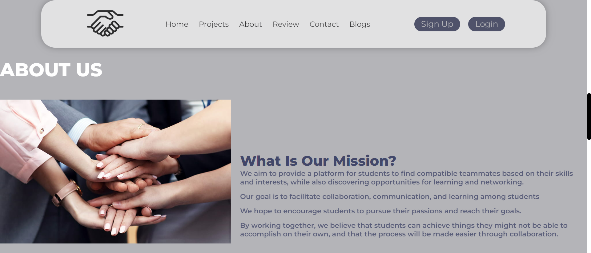
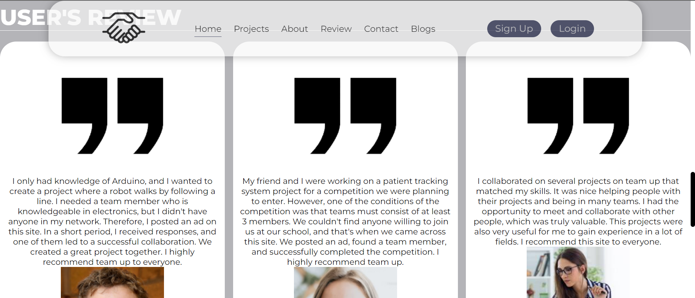
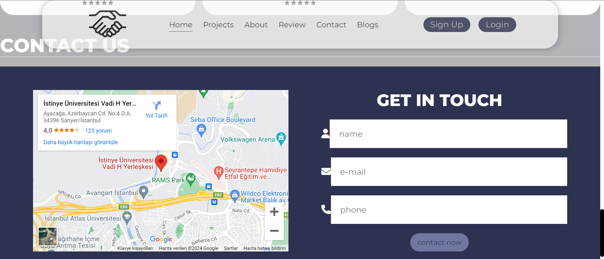
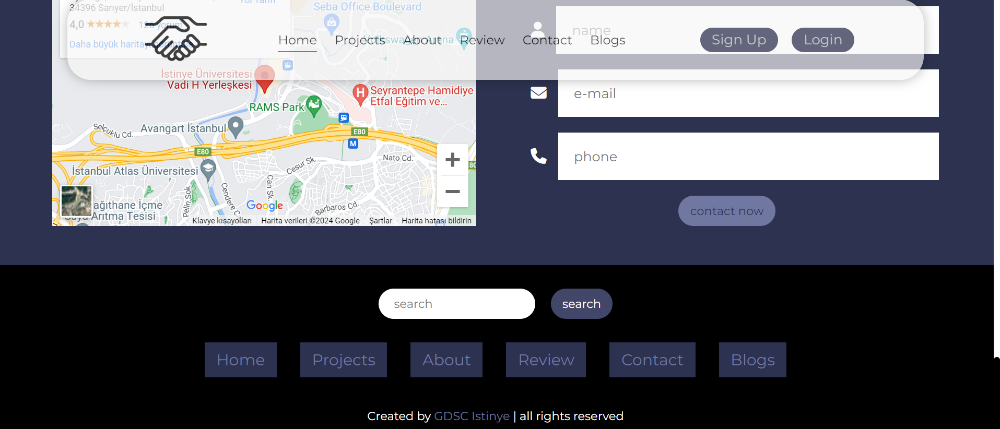
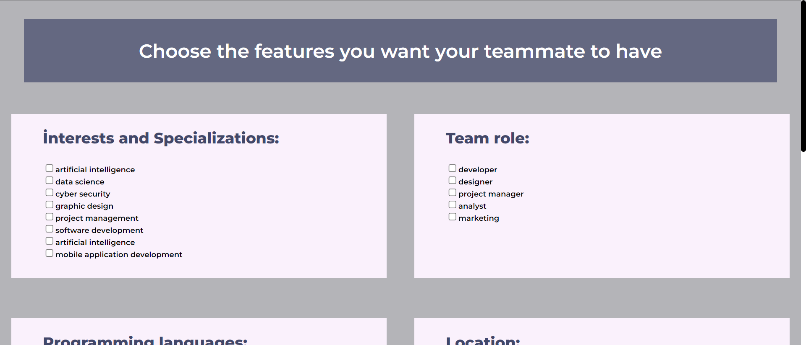
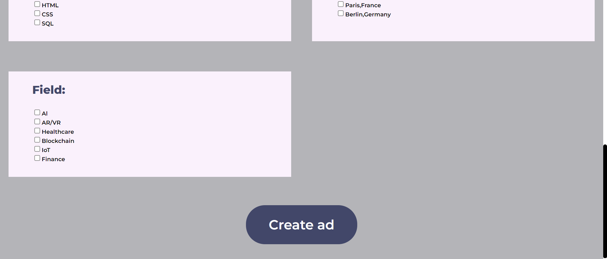
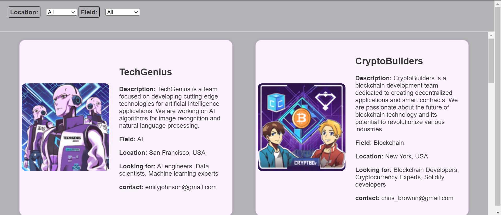

# team-up
## About

A website for finding teammates.
The Team Up website is a platform designed to facilitate collaboration and networking. The primary features of the website include:

- **Profile Creation:** Members can create personalized profiles showcasing their skills, interests, and projects.
- **Project Listing:** Users can list their projects, providing details such as project descriptions, technologies used, and team members.
- **Team Formation:** Members can search for projects they're interested in and join teams, or they can create their own projects and invite others to join.
- **Finding Teammates:** Members can specialize the skills for the teammates they are looking for.

## Installation

To run the project locally, follow these steps:

1. Clone the repository:
2. Navigate to the project directory:
3. Install dependencies:
4. Start the development server:
5. Open http://localhost:3000 in your web browser to view the website.

## Contributing

Contributions to the GDSC Team Up website are welcome! If you'd like to contribute, please follow these steps:

1. Fork the repository.
2. Create a new branch for your feature or bug fix: `git checkout -b feature-name`
3. Make your changes and commit them: `git commit -am 'Add new feature'`
4. Push to your branch: `git push origin feature-name`
5. Submit a pull request.

Please ensure that your pull request follows the project's coding conventions and includes relevant tests and documentation.

**screenshots**

